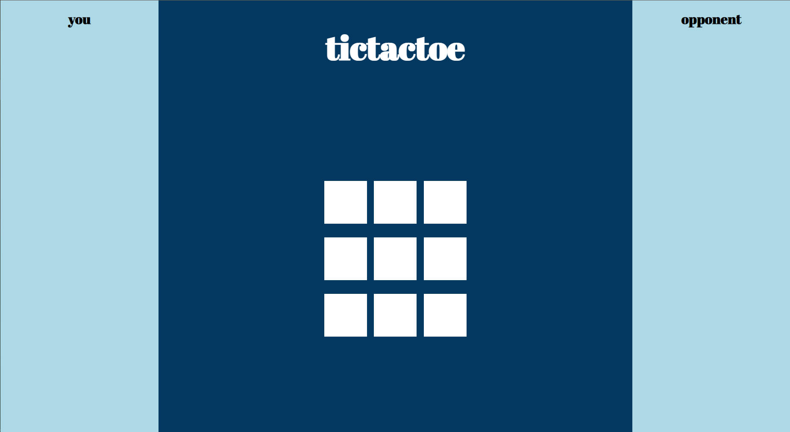
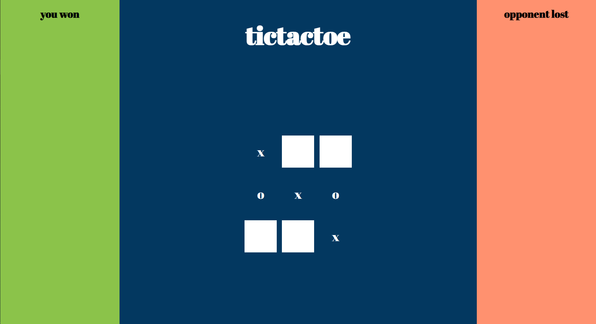

# Multiplayer TicTacToe

This is how it looks when two players are connected and the game has started.



This is how it looks when the game is in progress.



# Running

Both of the applications can be started using:

```bash
# go to backend/ and run
cd backend
npm start

# go to ui/ and run
cd ../ui
npm start
```

# Matching

Matching technique is utter garbage at the moment, basically you open the UI, and the backend checks if there's already someone who is already waiting for an opponent. Aaaaand you get matched. Voila! And yes, it can go wrong is so many ways it's crazy.